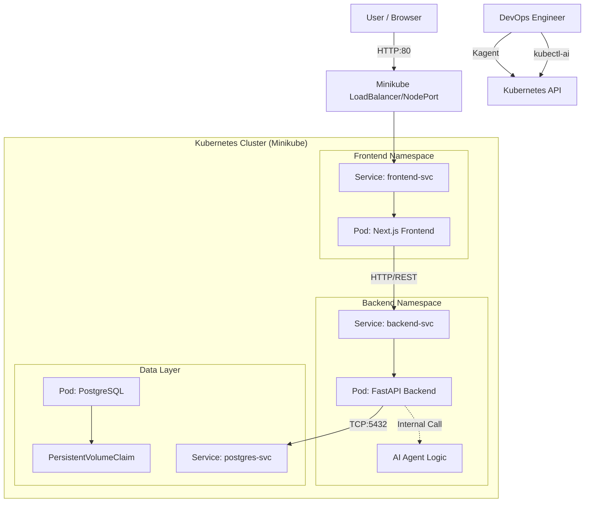

# Phase IV: Local Kubernetes Deployment (Spec-Driven)

## 🏗️ Cloud-Native Architecture Diagram

## 📂 Implementation Plan

### 1. Containerization (Docker)
- **Backend**: Python 3.9-slim based image. Optimized layering.
- **Frontend**: Node.js 18-alpine. Multi-stage build (Builder -> Runner).

### 2. Helm Charts (`k8s/helm/`)
- **todo-backend**: Deployment, Service, ConfigMap, Secrets (API Key).
- **todo-frontend**: Deployment, Service (NodePort/LoadBalancer), ConfigMap (API URL).
- **postgres** (Optional/Dependency): Basic stateful set or helper chart.

### 3. Orchestration Scripts
- `deploy_phase4.ps1`: Powershell automation to build images in Minikube env and apply Helm charts.

### 4. AI-Ops Integration
- Instructions for `kubectl-ai` to debug and manage.
- Instructions for `kagent` for optimization.

## 🧠 Research: Spec-Driven Infrastructure

### How Spec-Driven Development Enables Automation
By defining the infrastructure state in **Specification Files** (like this one) and **Declarative Manifests** (Helm/YAML), we create a "Source of Truth". AI Agents can read these specs to understand the *intent* of the infrastructure, not just the current messy state. This allows agents like `kubectl-ai` to perform semantic actions ("Scale the login service") rather than just syntactic ones.

### Role of Blueprints in Governing AI Agents
Blueprints act as the **Constitution** for AI infrastructure agents. They define:
- **Constraints**: "Never allow root user in containers."
- **Patterns**: "Sidecar pattern for logging."
- **Scope**: "Only modify resources in the `dev` namespace."
Without blueprints, AI agents act unpredictably. With blueprints, they become autonomous Site Reliability Engineers (SREs).

### Claude Code + SpecKit Support
- **SpecKit** maintains the `task.md` and `context.md`, ensuring the AI knows the full history.
- **Claude Code** acts as the generic architect, generating the specific tool configs (Docker/Helm) that specialized agents (Gordon, Kagent) then execute or optimize.

---

## 🛠️ Step-by-Step Implementation

1. **Create Dockerfiles**: Optimized for production.
2. **Setup Helm**: Standard directory structure.
3. **Deploy Script**: Automate the "inner loop" of dev-deploy-test.
